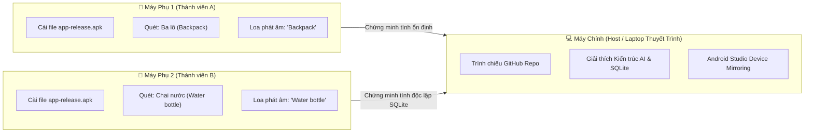

# 📸 VocabLens - Học Từ Vựng Tiếng Anh Qua Camera AI (Google ML Kit & SQLite)

<p align="center">
  
  
  
  
  
  
</p>

---

## 📖 1. Giới Thiệu Dự Án (Overview)

**VocabLens** là ứng dụng di động hỗ trợ học từ vựng tiếng Anh theo phương pháp trực quan sinh động: **"Chỉ cần hướng camera vào đồ vật, AI sẽ đọc tên và giải nghĩa cho bạn"**.

Ứng dụng kết hợp giữa **Trí tuệ nhân tạo (Google ML Kit Image Labeling)** chạy hoàn toàn ngoại tuyến (offline, 0đ chi phí API) và **Cơ sở dữ liệu quan hệ SQL (SQLite)** để lưu trữ lịch sử học tập bền vững ngay trên thiết bị di động.

---

## 🌟 2. Tính Năng Chính (Key Features)

- 🔍 **Nhận diện vật thể Real-time bằng AI:** Phân tích hình ảnh từ camera với Google ML Kit, tự động nhận diện đồ vật xung quanh (Laptop, chai nước, ba lô, bút viết, sách vở, mắt kính,...) với độ chính xác cao.
- 🔊 **Phát âm chuẩn tiếng Anh bản ngữ (TTS):** Sử dụng công nghệ Text-to-Speech (giọng chuẩn `en-US`), tự động phát âm ngay khi nhận diện vật thể hoặc chạm để nghe lại bất cứ lúc nào.
- 🇻🇳 **Từ điển song ngữ tích hợp:** Hiển thị từ vựng tiếng Anh kèm nghĩa tiếng Việt thân thuộc và độ tin cậy AI (Confidence score).
- 💾 **Lưu trữ CSDL SQL (SQLite):** Toàn bộ từ vựng quét được tự động lưu vào cơ sở dữ liệu `vocablens.db`, hỗ trợ đầy đủ các thao tác CRUD (Thêm, Đọc, Sửa trạng thái yêu thích, Xóa từng từ, Xóa toàn bộ).
- 🎨 **Giao diện Cyber-Dark hiện đại:** Kính ngắm quét laser công nghệ cao, đèn Flash trợ sáng, chuyển đổi camera trước/sau, thẻ hiển thị Bottom Sheet sang trọng.
- 📊 **Lịch sử & Ôn tập thông minh:** Tìm kiếm từ vựng (Anh/Việt), lọc danh sách từ yêu thích (⭐), hiển thị số lượng từ đã học bằng Badge thông báo thời gian thực.

---

## 🛠️ 3. Công Nghệ Cốt Lõi & Hệ Sinh Thái Thư Viện

| Hạng mục | Thư viện sử dụng | Vai trò trong ứng dụng |
| :--- | :--- | :--- |
| **Framework** | Flutter (Dart 3) | Xây dựng giao diện ứng dụng đa nền tảng mượt mà. |
| **Lõi AI** | `google_mlkit_image_labeling` | Nhận diện và gán nhãn vật thể offline với tốc độ cao, không cần kết nối Internet. |
| **Camera** | `camera` | Kết nối ống kính máy ảnh thiết bị, chụp ảnh truyền vào mô hình AI. |
| **Âm thanh (TTS)** | `flutter_tts` | Phát âm chuẩn tiếng Anh cho từ vựng nhận diện được. |
| **Cơ sở dữ liệu** | `sqflite` & `path` | Hệ quản trị CSDL SQLite cục bộ trên thiết bị di động. |
| **Quản lý trạng thái** | `provider` | Quản lý state danh sách từ vựng, cập nhật UI thời gian thực. |
| **Thời gian** | `intl` | Định dạng ngày giờ quét từ vựng chuẩn xác. |

---

## 📁 4. Cấu Trúc Mã Nguồn (Project Structure)

```text
lib/
├── main.dart                  # Điểm khởi động ứng dụng, thiết lập Theme và Bottom Navigation
├── models/
│   └── vocab_item.dart        # Data model từ vựng hỗ trợ SQLite (toMap / fromMap)
├── providers/
│   └── vocab_provider.dart    # Quản lý State bằng Provider kết nối SQLite
├── screens/
│   ├── camera_screen.dart     # Màn hình camera kính ngắm AI, chụp & quét vật thể
│   └── history_screen.dart    # Màn hình lịch sử từ vựng, tìm kiếm, lọc yêu thích, xóa
└── services/
    ├── database_helper.dart   # Quản lý SQLite database (bảng vocabularies, CRUD)
    ├── ml_kit_service.dart    # Core AI phân tích ảnh & từ điển song ngữ Anh - Việt
    └── tts_service.dart       # Dịch vụ phát âm chuẩn giọng bản ngữ en-US
```

---

## 🚀 5. Hướng Dẫn Cài Đặt & Chạy Ứng Dụng (Getting Started)

### Yêu cầu hệ thống:
- **Flutter SDK:** Phiên bản 3.10 trở lên (khuyến nghị 3.47+)
- **Android:** Tối thiểu Android 7.0 (API >= 24)
- **Thiết bị:** Máy ảo Android (Emulator) hoặc Điện thoại Android thật cắm cáp USB (khuyến nghị).

### Các bước khởi chạy:

1. **Clone repository về máy:**
   ```bash
   git clone https://github.com/<your-username>/vocablens.git
   cd vocablens
   ```

2. **Cài đặt các gói phụ thuộc (Dependencies):**
   ```bash
   flutter pub get
   ```

3. **Chạy ứng dụng ở chế độ Debug:**
   ```bash
   flutter run
   ```

4. **Đóng gói file cài đặt APK cho điện thoại thật:**
   ```bash
   flutter build apk --release
   ```
   *File APK sau khi build nằm tại:* `build/app/outputs/flutter-apk/app-release.apk`

---

## 🎬 6. Kịch Bản Thuyết Trình Demo (1 Máy Chính, 2+ Máy Phụ)

Kịch bản demo này giúp nhóm đạt điểm tuyệt đối trước Hội đồng / Giáo viên bộ môn Lập trình Thiết bị Di động (LTDD):



### 🔹 Phân công chi tiết:

1. **Máy chính (Laptop của người thuyết trình):**
   - Đảm nhận vai trò **Host**.
   - Mở màn hình lớn trình chiếu mã nguồn trên GitHub, giải thích cấu trúc thư mục `lib/` và cách SQLite lưu trữ bảng `vocabularies`.
   - Sử dụng tính năng **Device Mirroring** của Android Studio (hoặc phần mềm `Scrcpy`) để chiếu trực tiếp màn hình điện thoại đang chạy app lên máy chiếu lớp học.

2. **Máy phụ 1 & 2 (Điện thoại Android của các thành viên):**
   - Đã cài sẵn file `app-release.apk`.
   - **Tình huống thực tế:** Các thành viên cầm máy di chuyển trong phòng học:
     - Hướng camera vào **Ba lô**: Ứng dụng lập tức nhận diện `Backpack` -> Tự động phát âm rõ ràng -> Hiển thị nghĩa `Ba lô` và tự động lưu vào SQLite.
     - Hướng camera vào **Chai nước**: Nhận diện `Water bottle` -> Phát âm `Water bottle` -> Hiển thị nghĩa `Chai nước`.
     - Hướng camera vào **Laptop**: Nhận diện `Laptop` -> Phát âm `Laptop`.
   - Mở tab **"Từ Vựng (SQLite)"**: Cho Hội đồng thấy danh sách các từ vựng vừa quét đã được lưu trữ bền vững với thời gian thực, có thể tìm kiếm, lọc từ yêu thích và xóa mượt mà ngay cả khi ngắt kết nối mạng.

---

## 👥 7. Thông Tin Đồ Án

- **Môn học:** Lập trình Thiết bị Di Động (LTDD)
- **Tên đồ án:** VocabLens - Học từ vựng tiếng Anh qua Camera AI
- **Công nghệ chính:** Flutter • Google ML Kit Vision • SQLite (`sqflite`) • Flutter TTS
